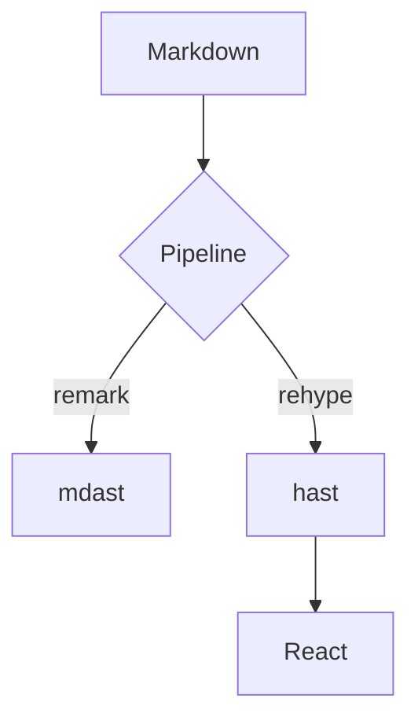
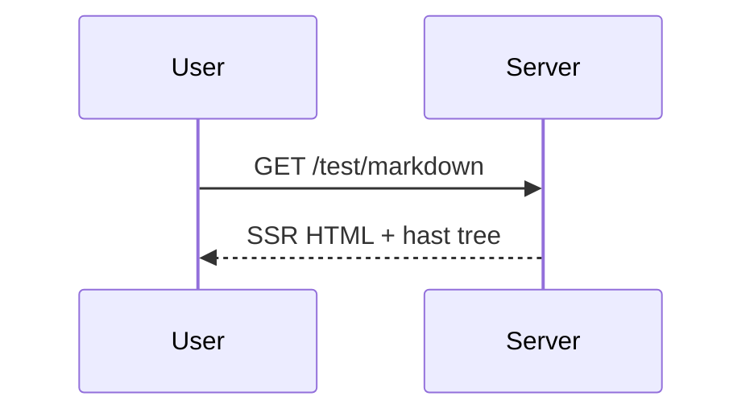
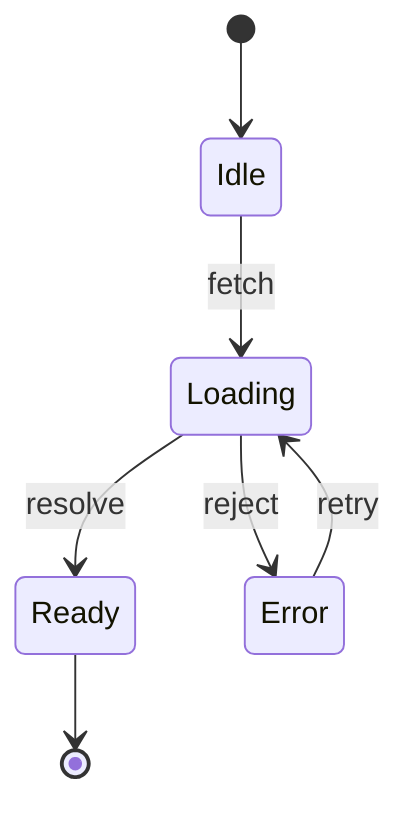
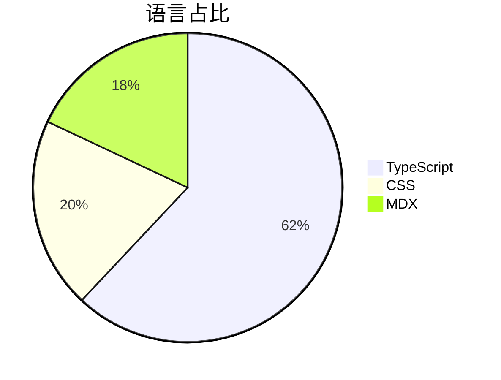

# Markdown 渲染测试 · Render Test Suite

This fixture exercises **every feature** of the markdown renderer, grouped
by category. Each section is self-contained; the ToC on the right should
mirror this structure exactly.

## Inline Syntax 行内语法

### Emphasis & Combinations

**Bold**, _italic_, _**bold italic**_, ~~strikethrough~~, ~~single-tilde
strike~~, and `inline code`.

Groupings: **bold with `code` inside**, _italic with a
[link](https://example.com)_, [link with **bold** and `code`](https://example.com),
~~strike with **bold**~~, **bold with _nested italic_**, and
`code where **markdown** is *not* parsed`.

Inline code containing a backtick: `` `wrapped` `` and a code span with
double backticks: ``a ` b``.

### Links & Autolinks

An inline [labelled link](https://github.com/tanstack/router) to a provider
URL must stay a normal link, NOT become a card. A link with a title:
[hover me](https://example.com 'Title text').

Reference-style links: [remark][remark-ref] and [rehype][rehype-ref] share
definitions at the bottom of this section.

Autolink in prose: https://developer.mozilla.org stays inline. GFM literal
autolink: www.example.com and an email autolink: hello@example.com.
Angle-bracket autolink: <https://developer.mozilla.org/ja/docs/Web>.

In-page anchor: [jump to Code Highlighting](#code-highlighting-代码高亮)
and [jump to 中文标题](#中文标题).

[remark-ref]: https://github.com/remarkjs/remark
[rehype-ref]: https://github.com/rehypejs/rehype

### Escapes, Entities & Breaks

Escaped characters render literally: \*not emphasized\*, \# not a heading,
1\. not a list, \`not code\`, \[not a link\].

HTML entities: &amp; &lt; &gt; &copy; &rarr; &hearts; and numeric
&#x1F600; &#8734;.

Literal emoji (no shortcode plugin): 🎉 ✨ 🦕 — ZWJ sequence 👨‍👩‍👧‍👦, flag 🇯🇵,
skin tone 👍🏽.

Hard break with a backslash\
lands on a new line. Hard break with two trailing spaces  
also lands on a new line, while a normal
single newline stays in the same paragraph.

## Multilingual 多语言 CJK

### 简体中文

这段文字用于测试简体中文的渲染效果。支持**加粗**、_斜体_、~~删除线~~、
`行内代码`以及[链接](https://example.com)。中文标点符号（、。「」《》——……）
应当与西文标点 (like this) 正常混排，全角与半角间距不应错乱。

已知的 CommonMark CJK 强调边界情况：这是**加粗，**接着普通文本——闭合分隔符
紧跟全角逗号时可能无法解析为加粗，此行用于确认实际行为。

### 繁體中文

這段文字用於測試繁體中文。支援**粗體**、_斜體_與`程式碼`，以及
[連結](https://example.com)。引號使用「單層」與『雙層』，
數學符號如 $\pi \approx 3.14159$ 可與內文混排。

### 日本語

日本語のレンダリングテストです。漢字・ひらがな・カタカナ（ラーメン🍜）が
混在し、**太字**、_斜体_、`コード`、[リンク](https://example.com)を含みます。
長音符「ー」と約物（、。「」・…）の組版も確認します。

### Mixed Scripts 混排

Testing 混排：English 与中文、日本語のカタカナ（テスト）、emoji 🎏,
`inline_code`, **粗体加粗**, _italic_ — all in one line, with
full-width（括号）and half-width (parens) side by side.

> 中文引用：包含日本語「引用文」in a single blockquote.

## Block Elements 块级元素

### Blockquotes 引用

> Simple blockquote with **nested formatting** and a
> [link](https://example.com).
>
> > Nested quote, 第二层嵌套引用。
> >
> > > 第三层 third level.

A blockquote containing other blocks:

> A list inside a quote:
>
> - item one
> - item two with `code`
>
> ```ts
> const insideQuote = true
> ```
>
> And display math: $a^2 + b^2 = c^2$

### Lists 列表

Unordered, three levels deep:

- Level one
  - Level two 第二层
    - Level three 第三层 with **bold** and `code`
  - Back to level two
- Level one again

Ordered list starting at 42:

42. The answer
43. One more than the answer
44. Nested mixed content:
    1. Ordered inside ordered
    - Unordered inside ordered
    - With a [link](https://example.com)

A loose list (items become paragraphs):

- First loose item.

- Second loose item, with a second block:

  It has an indented child paragraph.

- Third loose item containing a table:

  | Key | Value |
  | --- | ----- |
  | a   | 1     |
  | b   | 2     |

Task lists, including nesting:

- [x] Ship GFM support
- [x] Highlight with shiki
- [ ] World domination
  - [x] Sub-task done 子任务
  - [ ] Sub-task pending 未完成

### Tables 表格

Column alignment (left / center / right):

| Left aligned | Centered | Right aligned |
| :----------- | :------: | ------------: |
| one          |   two    |         three |
| 靠左         |   居中   |          靠右 |

Formatting inside cells, including an escaped pipe:

| Syntax        | Example                        |
| ------------- | ------------------------------ |
| Bold + code   | **bold** and `code`            |
| Link          | [example](https://example.com) |
| Inline math   | $O(n \log n)$                  |
| Strikethrough | ~~deprecated~~                 |
| Escaped pipe  | a \| b                         |
| Footnote ref  | see note[^1]                   |

CJK table:

| 语言     | 表記       | Status |
| -------- | ---------- | :----: |
| 简体中文 | 你好，世界 |   ✅   |
| 繁體中文 | 你好，世界 |   ✅   |
| 日本語   | こんにちは |   ✅   |

### Horizontal Rules 分隔线

Text above the rule.

---

Text below the rule.

## Footnotes 脚注

Here is a footnote reference[^1], a named one[^note], the first one
reused[^1], and a CJK footnote[^cjk]. Finally, a multi-paragraph
footnote[^long].

[^1]: The first footnote.

[^note]: A named footnote with [a link](https://example.com).

[^cjk]: 中文脚注，包含**加粗**、日本語のテキスト。

[^long]: A footnote with multiple paragraphs.

    This is the second paragraph, and it contains `inline code`.

## Raw HTML 原生标签

<details>
  <summary>Click to expand (raw HTML through rehype-raw)</summary>
  <p>Hidden content with <strong>markup</strong>, 中文とにほんご。</p>
</details>

Keyboard keys: press <kbd>⌘</kbd> + <kbd>K</kbd> to search, or
<kbd>Ctrl</kbd> + <kbd>Shift</kbd> + <kbd>P</kbd>.

Subscript and superscript: H<sub>2</sub>O, E = mc<sup>2</sup>,
CO<sub>2</sub>, x<sup>n</sup>.

<mark>Highlighted text</mark>, <ins>inserted text</ins>, and an
abbreviation: <abbr title="Cascading Style Sheets">CSS</abbr>.

Japanese ruby annotation: <ruby>漢字<rt>かんじ</rt></ruby> と
<ruby>振り仮名<rt>ふりがな</rt></ruby>.

## Math 数学 (KaTeX)

Inline math: $E = mc^2$, $\hbar \frac{\partial}{\partial t} \Psi = \hat{H}
\Psi$, Euler's sum $\sum_{n=1}^{\infty} \frac{1}{n^2} = \frac{\pi^2}{6}$,
and CJK inside math: $\text{速度} = \frac{\text{距离}}{\text{时间}}$.

Display math — integral:

$$
\int_0^\infty e^{-x^2}\,dx = \frac{\sqrt{\pi}}{2}
$$

Cases:

$$
f(x) = \begin{cases}
  x^2 & x \ge 0 \\
  -x  & x < 0
\end{cases}
$$

Matrices:

$$
\begin{pmatrix} a & b \\ c & d \end{pmatrix}
\begin{pmatrix} x \\ y \end{pmatrix} =
\begin{pmatrix} ax + by \\ cx + dy \end{pmatrix}
$$

Aligned equations (Maxwell, differential form):

$$
\begin{aligned}
\nabla \cdot \mathbf{E} &= \frac{\rho}{\varepsilon_0} \\
\nabla \cdot \mathbf{B} &= 0 \\
\nabla \times \mathbf{E} &= -\frac{\partial \mathbf{B}}{\partial t} \\
\nabla \times \mathbf{B} &= \mu_0 \mathbf{J} + \mu_0 \varepsilon_0
  \frac{\partial \mathbf{E}}{\partial t}
\end{aligned}
$$

## Code Highlighting 代码高亮

### TypeScript & React

Title via `title=` meta:

```ts title=src/lib/markdown/pipeline.ts
interface MarkdownResult {
  tree: Root
  toc: TocEntry[]
  frontmatter: Record<string, unknown>
}

const render = async (content: string): Promise<MarkdownResult> =>
  processMarkdown(content)
```

Title with spaces via `title="…"`:

```tsx title="components/Hello World.tsx"
export const Hello = ({ name }: { name: string }) => (
  <section className="hello">
    <h1>Hello, {name}!</h1>
    {[...name].map((ch, i) => (
      <span key={i}>{ch}</span>
    ))}
  </section>
)
```

```js
const wait = ms => new Promise(resolve => setTimeout(resolve, ms))

export async function* countdown(from) {
  for (let i = from; i > 0; i--) {
    yield i
    await wait(1000)
  }
}
```

```jsx
function Badge({ children, tone = 'info' }) {
  return <span className={`badge badge-${tone}`}>{children}</span>
}

export default () => <Badge tone="success">已通过</Badge>
```

### Web Platform

```html
<!doctype html>
<html lang="zh-CN">
  <head>
    <meta charset="utf-8" />
    <title>ハローワールド</title>
  </head>
  <body>
    <p>你好，<strong>world</strong>!</p>
  </body>
</html>
```

```css
:root {
  --accent: oklch(0.7 0.15 250);
}

@media (prefers-color-scheme: dark) {
  .card {
    background: color-mix(in oklch, var(--accent) 20%, transparent);
  }

  .card:hover::after {
    content: '→';
  }
}
```

```json
{
  "name": "planet",
  "private": true,
  "languages": ["中文", "日本語"],
  "pi": 3.14159,
  "nested": { "deep": { "value": null } }
}
```

### Systems & Data

Title via `:path` fence syntax, with a CJK docstring:

```python:examples/fib.py
def fib(n: int) -> int:
    """斐波那契数列（递归版）"""
    return n if n < 2 else fib(n - 1) + fib(n - 2)

print([fib(i) for i in range(10)])
```

```rust
#[derive(Debug)]
enum Shape {
    Circle { radius: f64 },
    Rect { w: f64, h: f64 },
}

fn area(shape: &Shape) -> f64 {
    match shape {
        Shape::Circle { radius } => std::f64::consts::PI * radius * radius,
        Shape::Rect { w, h } => w * h,
    }
}

fn main() {
    let total: f64 = [Shape::Circle { radius: 1.0 }, Shape::Rect { w: 3.0, h: 4.0 }]
        .iter()
        .map(area)
        .sum();
    println!("total area = {total:.2}");
}
```

```go
package main

import "fmt"

// ワーカーはジョブを受け取り、2 倍にして返す
func worker(jobs <-chan int, results chan<- int) {
	for j := range jobs {
		results <- j * 2
	}
}

func main() {
	jobs := make(chan int, 5)
	results := make(chan int, 5)
	for w := 0; w < 3; w++ {
		go worker(jobs, results)
	}
	for j := 1; j <= 5; j++ {
		jobs <- j
	}
	close(jobs)
	for i := 0; i < 5; i++ {
		fmt.Println(<-results)
	}
}
```

```sql
-- 最近 30 天阅读量最高的文章
SELECT p.title, COUNT(v.id) AS views
FROM posts AS p
JOIN post_views AS v ON v.post_id = p.id
WHERE v.viewed_at >= NOW() - INTERVAL '30 days'
GROUP BY p.id, p.title
HAVING COUNT(v.id) > 100
ORDER BY views DESC
LIMIT 10;
```

### Config & Shell

```bash
#!/usr/bin/env bash
set -euo pipefail

BRANCH="$(git rev-parse --abbrev-ref HEAD)"

if [[ "$BRANCH" == "main" ]]; then
  echo "refusing to deploy from main" >&2
  exit 1
fi

pnpm build && pnpm deploy | tee "logs/deploy-$(date +%F).log"
```

```yaml
name: CI
on:
  push:
    branches: [main]
jobs:
  build:
    runs-on: ubuntu-latest
    steps:
      - uses: actions/checkout@v4
      - run: pnpm install --frozen-lockfile
      - run: pnpm build
```

```toml
[package]
name = "planet"
version = "0.1.0"
edition = "2024"

[dependencies]
serde = { version = "1", features = ["derive"] }

[profile.release]
lto = "thin"
```

```dockerfile title=Dockerfile
FROM node:22-alpine AS build
WORKDIR /app
COPY package.json pnpm-lock.yaml ./
RUN corepack enable && pnpm install --frozen-lockfile
COPY . .
RUN pnpm build

FROM nginx:alpine
COPY --from=build /app/dist /usr/share/nginx/html
EXPOSE 80
```

### Special Formats

```diff
- const theme = 'light'
+ const theme = detectTheme() ?? 'light'
```

Markdown inside a fence (four-backtick outer fence):

````md
# 嵌套的 Markdown

- A list **inside** a fence
- With a [link](https://example.com)

```js
console.log('a fence inside a fence')
```
````

```text
Plain text block: no highlighting, 中文も日本語も as-is.
```

```someunknownlang
Unknown languages fall back to plain text without crashing.
```

An indented code block (CommonMark, no fence):

    indented code block
    also renders as plain text

### Folding 折叠

A deliberately long block (> 30 lines) to exercise code folding:

```ts title=src/long-example.ts
export interface Shape {
  kind: 'circle' | 'square' | 'triangle'
  area(): number
}

export class Circle implements Shape {
  kind = 'circle' as const
  constructor(readonly radius: number) {}
  area() {
    return Math.PI * this.radius ** 2
  }
}

export class Square implements Shape {
  kind = 'square' as const
  constructor(readonly side: number) {}
  area() {
    return this.side ** 2
  }
}

export class Triangle implements Shape {
  kind = 'triangle' as const
  constructor(
    readonly base: number,
    readonly height: number,
  ) {}
  area() {
    return (this.base * this.height) / 2
  }
}

export const totalArea = (shapes: Shape[]) =>
  shapes.reduce((sum, shape) => sum + shape.area(), 0)

export const describe = (shape: Shape) =>
  `${shape.kind} with area ${shape.area().toFixed(2)}`

const shapes: Shape[] = [
  new Circle(1),
  new Square(2),
  new Triangle(3, 4),
  new Circle(5),
]

for (const shape of shapes) {
  console.log(describe(shape))
}

console.log('total:', totalArea(shapes).toFixed(2))
```

## Mermaid 图表









## Link Cards 链接卡片

### GitHub

User profile:

https://github.com/AlisaAkiron

Organization profile:

https://github.com/MaaAssistantArknights

Repository (English description):

https://github.com/tanstack/router

Repository (中文 description):

https://github.com/MaaAssistantArknights/MaaAssistantArknights

Merged pull request:

https://github.com/facebook/react/pull/25231

Open issue:

https://github.com/microsoft/TypeScript/issues/9998

Closed issue:

https://github.com/rust-lang/rust/issues/1

File snippet (whole file, then with a line range):

https://github.com/tanstack/router/blob/main/packages/router-core/src/index.ts

https://github.com/tanstack/router/blob/main/packages/router-core/src/index.ts#L1-L20

Directory tree (raw fetch fails → falls back to URL-parsed card):

https://github.com/tanstack/router/tree/main/packages/router-core

### GitLab（含自建实例 / self-hosted）

Group profile on gitlab.com:

https://gitlab.com/gitlab-org

Project, merge request, and issue:

https://gitlab.com/gitlab-org/gitlab

https://gitlab.com/gitlab-org/gitlab/-/merge_requests/1

https://gitlab.com/gitlab-org/gitlab/-/issues/1

File snippet:

https://gitlab.com/gitlab-org/gitlab/-/blob/master/README.md

Self-hosted instances (whitelisted hosts):

https://git.alisaqaq.moe/alisa

https://gitlab.gnome.org/GNOME/gtk

https://gitlab.gnome.org/GNOME/gtk/-/blob/main/meson.build#L1-15

https://gitlab.freedesktop.org/mesa/mesa

Non-whitelisted GitLab-looking host stays a plain link:

https://gitlab.example.com/some/project

### X (Twitter)

Profile and post:

https://x.com/alisaqaq

https://x.com/alisaqaq/status/2061453077367173553

### Telegram

Channel, post with media, `/s/`-prefixed post, and another channel's post:

https://t.me/durov

https://t.me/durov/342

https://t.me/s/durov/335

https://t.me/telegram/321

### Video: YouTube / Bilibili（点击播放）

https://www.youtube.com/watch?v=dQw4w9WgXcQ

https://youtu.be/dQw4w9WgXcQ?t=43

https://www.youtube.com/shorts/dQw4w9WgXcQ

https://www.bilibili.com/video/BV1FW411E77Y

Legacy `av` id (no metadata API → URL-parsed fallback card):

https://www.bilibili.com/video/av170001

### Profiles: Bilibili / YouTube 用户主页

https://space.bilibili.com/5627849

https://www.youtube.com/@CoreDumpped

### Negative Controls 非卡片链接

A non-provider URL alone in a paragraph stays a plain autolink:

https://example.com/some/deep/page

A provider URL inside a sentence — like https://github.com/tanstack/router
here — stays inline, and a [labelled provider
link](https://github.com/tanstack/router) stays a normal link.

## Media Embeds 媒体嵌入

Bare video links (mp4, then webm):

https://interactive-examples.mdn.mozilla.net/media/cc0-videos/flower.mp4

https://interactive-examples.mdn.mozilla.net/media/cc0-videos/flower.webm

Bare audio link:

https://interactive-examples.mdn.mozilla.net/media/cc0-audio/t-rex-roar.mp3

Audio via image syntax (alt text becomes the title):


## Headings & Anchors 标题锚点

Duplicate headings must get `-1` / `-2` suffixed slugs; CJK and emoji must
survive slugging (links in [Links & Autolinks](#links--autolinks) point
here).

### 中文标题

### 中文标题

### 繁體中文標題

### 日本語の見出し

### 🚀 Emoji Heading!

### Mixed 中英文 Heading

#### Fourth Level 四级标题

##### Fifth Level 五级标题

###### Sixth Level 六级标题

Edge Cases 边界情况（Setext 标题）
----------------------------------

This section heading itself uses setext (`---` underline) syntax.

### Images 图片


[](https://example.com)


### Overflow 溢出

A very long unbroken word:
Pneumonoultramicroscopicsilicovolcanoconiosis­supercalifragilisticexpialidocious­floccinaucinihilipilification.

A long URL as text:
https://example.com/a/very/deep/path/segment/that/keeps/going/and/going?with=query&params=1234567890&and=more&stuff=abcdefghijklmnopqrstuvwxyz

Long inline code:
`--this-is-an-extremely-long-inline-code-span-meant-to-test-wrapping-behavior-of-inline-code-inside-paragraphs-1234567890`

A wide table that must scroll horizontally instead of breaking the layout:

| Column 1 | Column 2 | Column 3 | Column 4 | Column 5 | Column 6 | Column 7 | Column 8 | Column 9 | Column 10 |
| -------- | -------- | -------- | -------- | -------- | -------- | -------- | -------- | -------- | --------- |
| 数据一   | データ二 | 資料三   | value 4  | value 5  | value 6  | value 7  | value 8  | value 9  | value 10  |

---

That's all — scroll back up and watch the ToC highlight follow you. 完 🎉
